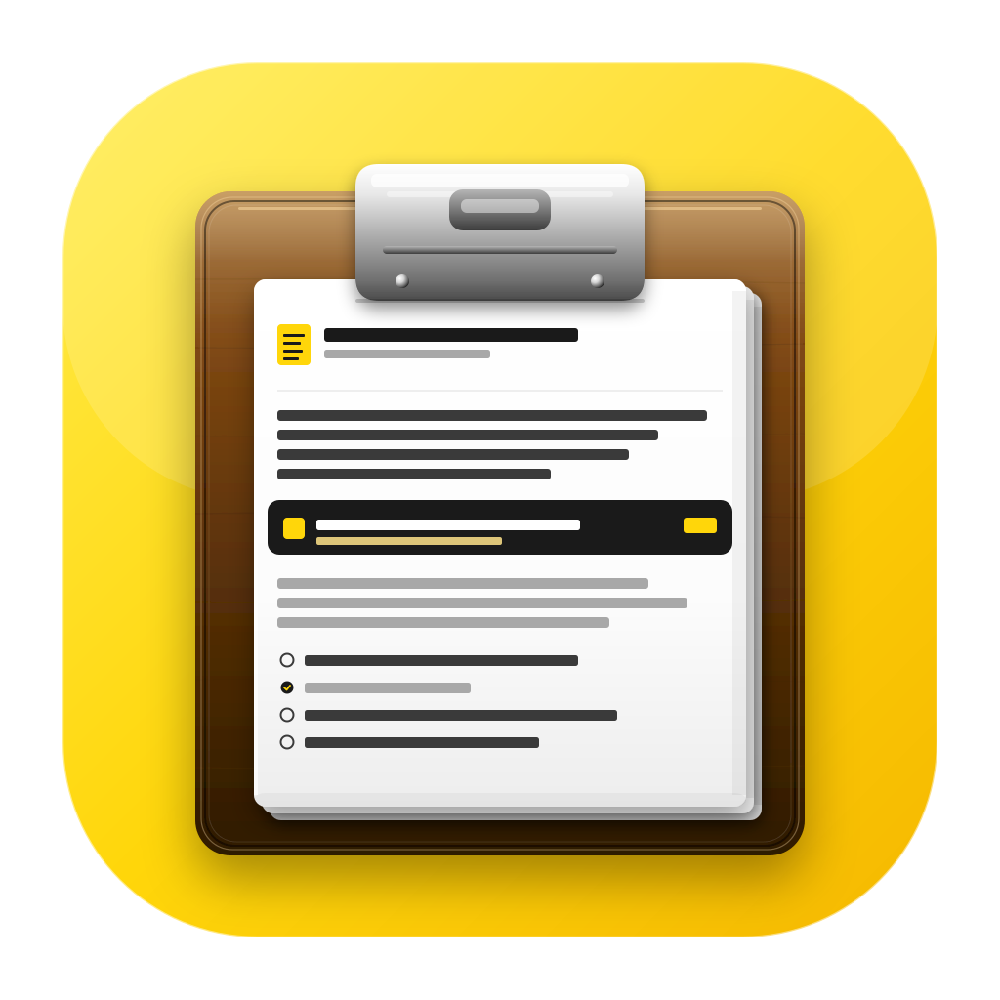
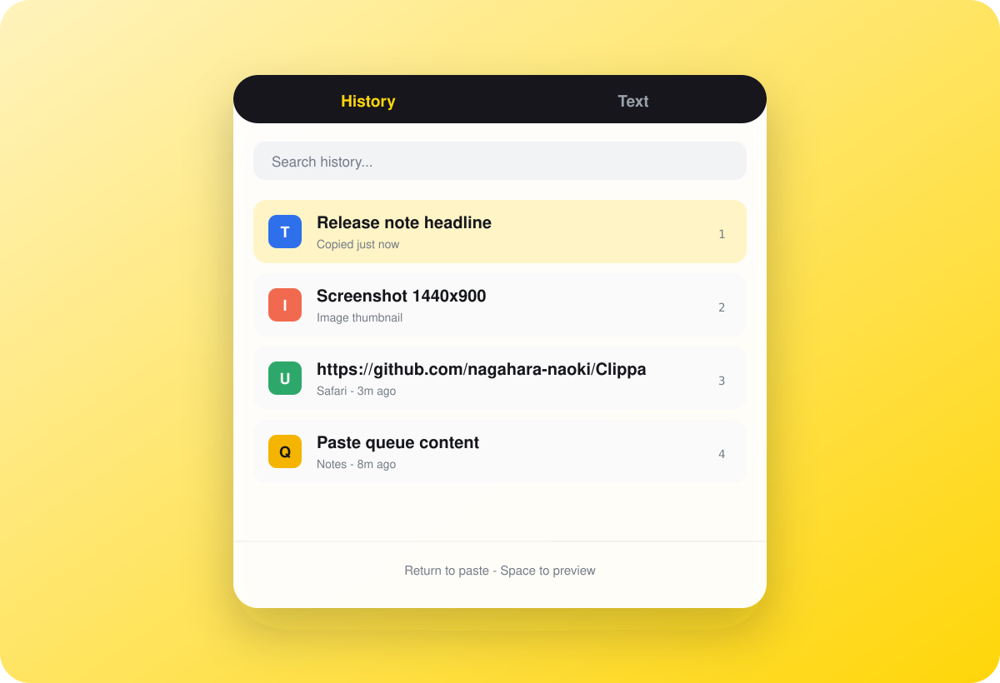
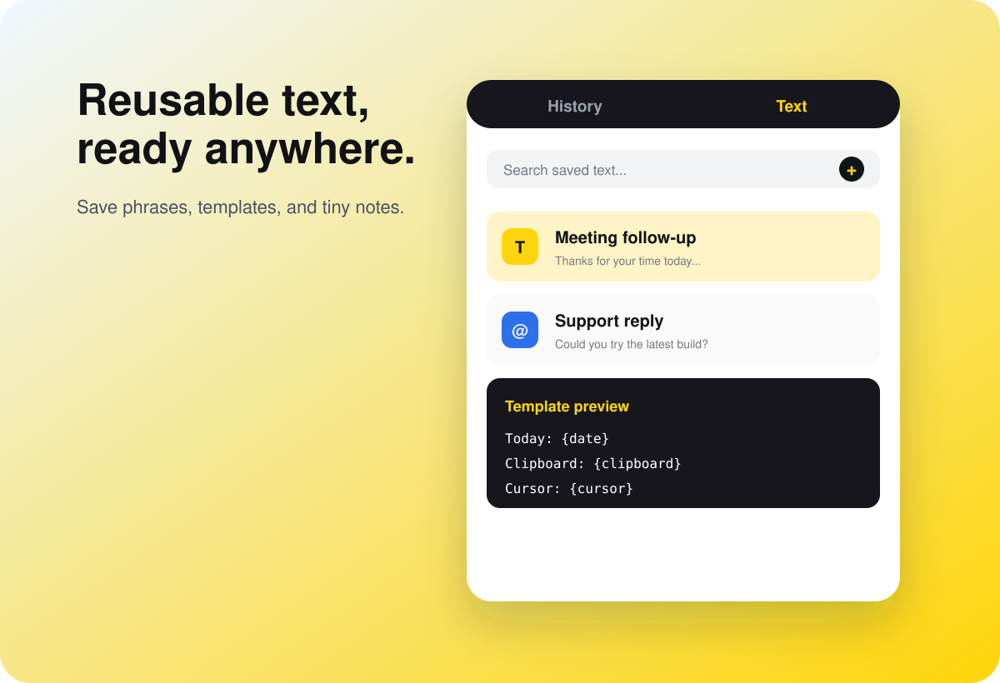
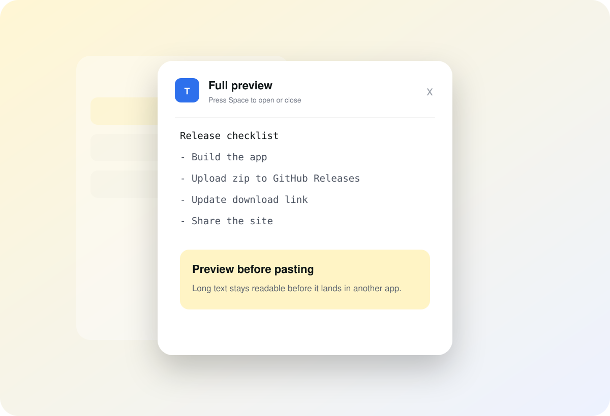

<p align="center">
  
</p>

<h1 align="center">Clippa</h1>

<p align="center">
  Clipboard history for Mac. Press <strong>Cmd+Shift+V</strong>, find what you copied, and paste it back instantly.
</p>

<p align="center">
  <a href="./README.ja.md">日本語</a>
  ·
  <a href="./docs/index.html">Website</a>
  ·
  <a href="https://github.com/nagahara-naoki/Clippa/releases/latest">Download</a>
</p>

<p align="center">
  
  
  
  
</p>



## Why Clippa

macOS overwrites the clipboard every time you copy something. Clippa gives you a small native history window so the text, link, image, or screenshot you copied a moment ago is still recoverable.

It is designed to feel like the missing Mac version of Windows `Win+V`: quick to open, keyboard-friendly, and out of your way when you are done.

## Features

- **Global shortcut**: open Clippa with `Cmd+Shift+V`.
- **Clipboard history**: keep text, URLs, rich text, HTML, file URLs, images, and screenshots.
- **Fast search**: filter history by typing a few letters.
- **Keyboard-first workflow**: use `↑` / `↓`, `Return`, `Space`, `Esc`, `1`-`9`, and `←` / `→`.
- **Quick preview**: press `Space` to inspect longer clips before pasting.
- **Pinned items**: keep important clips close.
- **Saved text**: store reusable phrases and templates.
- **Template variables**: use `{date}`, `{time}`, `{datetime}`, `{clipboard}`, and `{cursor}`.
- **Paste queue**: paste saved items one after another.
- **Menu bar app**: runs quietly without a Dock icon.
- **Local storage**: clipboard data stays on your Mac.

## Screens

<p align="center">
  
  
  
</p>

## Install

1. Download the latest app from [GitHub Releases](https://github.com/nagahara-naoki/Clippa/releases/latest).
2. Move `Clippa.app` to your `Applications` folder.
3. Launch Clippa from `Applications`.
4. Allow Accessibility permission when macOS asks for it.
5. Press `Cmd+Shift+V` to open the history popup.

Accessibility permission is needed so Clippa can paste the selected item into the app you were using.

## Usage

| Action | Shortcut |
| --- | --- |
| Open Clippa | `Cmd+Shift+V` |
| Move selection | `↑` / `↓` |
| Paste selected item | `Return` |
| Preview selected item | `Space` |
| Paste item 1-9 | `1` ... `9` |
| Switch tabs | `←` / `→` |
| Close popup | `Esc` |

## Privacy

Clippa is local-first. History data is stored under:

```text
~/Library/Application Support/Clippa/
```

The app does not need a server to store your clipboard history. Password-manager style concealed pasteboard items are skipped when detected.

## Build From Source

Requirements:

- macOS 13 or later for development
- Xcode 15 or later
- XcodeGen

Generate the Xcode project:

```bash
brew install xcodegen
xcodegen generate
open Clippa.xcodeproj
```

Build from the command line:

```bash
xcodebuild build \
  -project Clippa.xcodeproj \
  -scheme Clippa \
  -configuration Release \
  -destination 'platform=macOS'
```

Run tests:

```bash
xcodebuild test \
  -project Clippa.xcodeproj \
  -scheme Clippa \
  -destination 'platform=macOS'
```

More details are in [BUILD.md](./BUILD.md).

## Project Structure

```text
Sources/Clippa/
├── App/          App startup and lifecycle
├── MenuBar/      macOS menu bar integration
├── Models/       Clip and saved text models
├── Services/     Clipboard monitor, storage, paste engine, hotkey handling
├── UI/           SwiftUI and AppKit popup views
└── Utils/        Paths, logging, permissions, brand helpers
```

## Website

The GitHub Pages site lives in [docs/index.html](./docs/index.html). Set GitHub Pages to serve from the `docs` folder when publishing this repository.

## License

Copyright © 2026 Clippa. All rights reserved.
# Clippa
